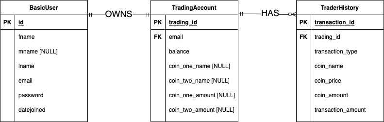

# **Cryptocurrency Trading Simulator App** 
#### Website URL: https://the-perfect-trader.herokuapp.com/
#### Creator: Ronak Trivedi

 
 

# **Mission**
**Origin:**

Nowadays, an unprecedented amount of people want to learn how to trade cryptocurrencies, but the risk of losing money is too high. I am hoping that using my cryptocurrency-trading simulator will help people gain the necessary skills in order to make profits in the long run.

**Goals:**
1) Help people learn how to trade cryptocurrencies for free
2) Provide cyrptocurrency information tailored to users' needs
3) Collect and aggregate user data

 
 

# **Critical Development Tools**
- #### Node.js
- #### SQLite3
- #### CoinGecko API
- #### Heroku
- #### Passport.js
- #### EJS
- #### Jest Testing Framework

 
 

# **Entity-Relation Diagram of Database**

 
 

# **Local Useage**
#### **Launch in browser:**
- #### In a terminal, navigate to the crypto_simulator directory from the root directory of the project.
- #### Run the command:  `npm start` 
- #### In a web browser, visit:  `localhost:4000`

#### **Run test cases:**
- #### In a terminal, navigate to the crypto_simulator directory from the root directory of the project.
- #### Run the command:  `npm test` 
- #### Observe testing results in the console.

 
 

